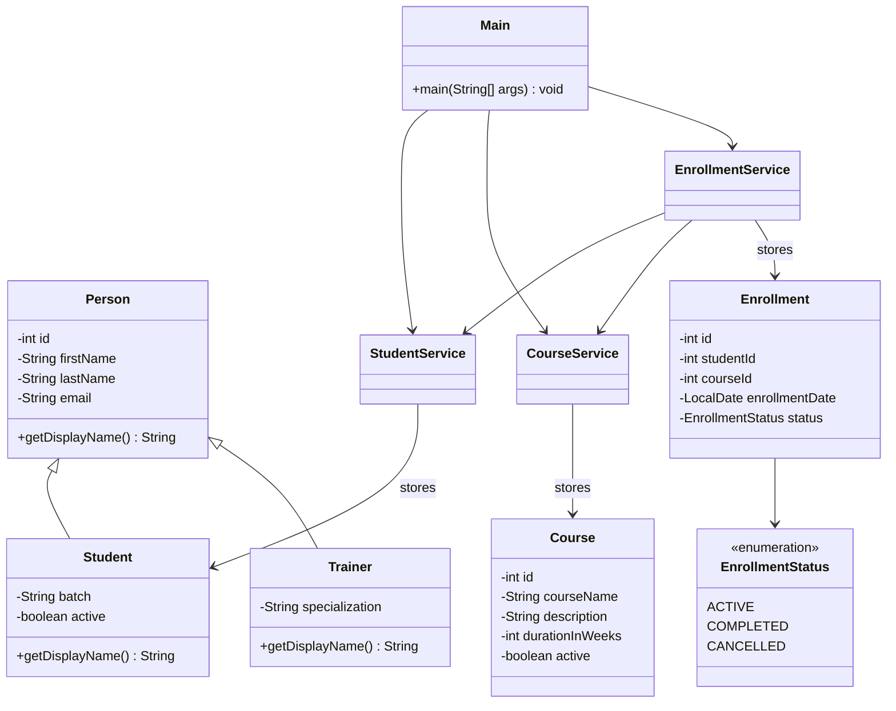

# LearnTrack

**LearnTrack** is a menu-driven **console application** for admins to manage **students**, **courses**, and **enrollments**. It uses **Core Java** only: data lives in **`ArrayList`** (in-memory), with **entity**, **service**, **ui**, **exception**, and **util** layers under `com.airtribe.learntrack`.

**Features:** add/list/search/update students; deactivate students; add/list/search courses; activate/deactivate courses; enroll students; list enrollments; mark enrollments completed or cancelled. Errors use **try-catch** and custom exceptions so invalid input does not crash the app.

---

## Class diagram

Relationships between main types: **inheritance** (`Person` → `Student` / `Trainer`), **composition** (`Enrollment` uses `EnrollmentStatus`), **service dependencies** (`EnrollmentService` uses `StudentService` and `CourseService`), and **UI** (`Main` calls the three services).



*(If your viewer does not render Mermaid, open this file on GitHub or use an IDE/plugin that supports Mermaid.)*

---

## How to run

**Requirement:** JDK 17+ (`java -version`).

- **Gradle:** `.\gradlew.bat run` (Windows) or `./gradlew run`
- **IntelliJ:** Open the project → open `src/main/java/com/airtribe/learntrack/ui/Main.java` → run `main`
- **Manual (PowerShell):**

```powershell
javac -d out -encoding UTF-8 (Get-ChildItem -Path src/main/java -Recurse -Filter *.java | ForEach-Object { $_.FullName })
java -cp out com.airtribe.learntrack.ui.Main
```

---

## Project layout

`docs/` — `Setup_Instructions.md`, `JVM_Basics.md`, `Design_Notes.md` · `src/main/java/com/airtribe/learntrack/` — `ui`, `entity`, `service`, `exception`, `util` · `build.gradle.kts`

---

## Submission

Per assignment guidelines:

1. Host the project in a **public** GitHub repository (Settings → General → Danger Zone: ensure it is not private).
2. Submit your work as a **Pull Request** (PR) from a feature branch into `main` (or as instructed by your coach).
3. Turn in **both** links:
   - **Repository:** `https://github.com/<your-username>/<your-repo>`
   - **Pull Request:** `https://github.com/<your-username>/<your-repo>/pull/<number>`

Replace the placeholders above with your real URLs when you submit.
