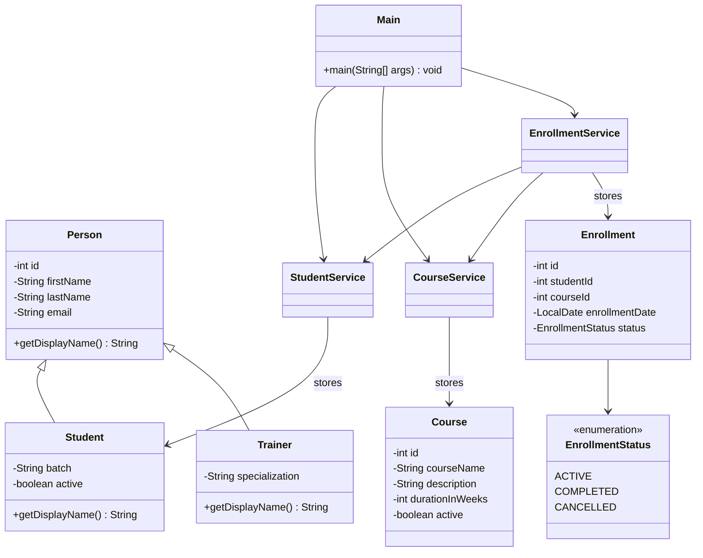

# LearnTrack

**LearnTrack** is a menu-driven **console application** for admins to manage **students**, **courses**, and **enrollments**. It uses **Core Java** only: data lives in **`ArrayList`** (in-memory), with **entity**, **service**, **ui**, **exception**, and **util** layers under `com.airtribe.learntrack`.

**Features:** add/list/search/update students; deactivate students; add/list/search courses; activate/deactivate courses; enroll students; list enrollments; mark enrollments completed or cancelled. Errors use **try-catch** and custom exceptions so invalid input does not crash the app.

---

## Class diagram

Relationships: **inheritance** (`Person` → `Student` / `Trainer`), **composition** (`Enrollment` → `EnrollmentStatus`), **services** (`EnrollmentService` uses `StudentService` and `CourseService`), **UI** (`Main` calls the three services).



*(View this file on GitHub or an IDE that renders Mermaid.)*

---

## How to run

**Requirement:** JDK 17+ (`java -version`).

- **Gradle:** `.\gradlew.bat run` (Windows) or `./gradlew run` after generating the wrapper (see below).
- **IntelliJ:** Open the project → run `src/main/java/com/airtribe/learntrack/ui/Main.java` → `main`.
- **Manual (PowerShell):**

```powershell
javac -d out -encoding UTF-8 (Get-ChildItem -Path src/main/java -Recurse -Filter *.java | ForEach-Object { $_.FullName })
java -cp out com.airtribe.learntrack.ui.Main
```

If `gradlew.bat` is missing, from the project root run **`gradle wrapper`** (Gradle installed), or use the manual `javac` / `java` lines above.

---

## Project layout

`docs/` — `Setup_Instructions.md`, `JVM_Basics.md`, `Design_Notes.md` · `src/main/java/com/airtribe/learntrack/` — `ui`, `entity`, `service`, `exception`, `util` · `build.gradle.kts`

---

## Submission

1. **Public** GitHub repository (Settings → visibility → **Public**).
2. Submit as a **Pull Request**; provide **both** the **repository URL** and the **PR URL**.
3. If `main` is intentionally minimal and the full app lives on branch `US01_AssignmentSubmissionLearnTrack`, open the PR **from that branch into `main`** so reviewers see the full diff.

Replace placeholders with your real links:

- Repository: `https://github.com/YourUsername/LearnTrack`
- Pull request: `https://github.com/YourUsername/LearnTrack/pull/1`

---

## What went wrong in the editor (important)

- **README must be plain Markdown.** Do not paste terminal commands like `Set-Content ...` into `README.md`; run those only in **PowerShell**.
- **Git commands** must be run in the **project root** where the `.git` folder lives:  
  `D:\Amit Data\D Drive\Project\LearnTrack`  
  If you see `fatal: not a git repository`, `cd` to that folder first, then run `git status`.
